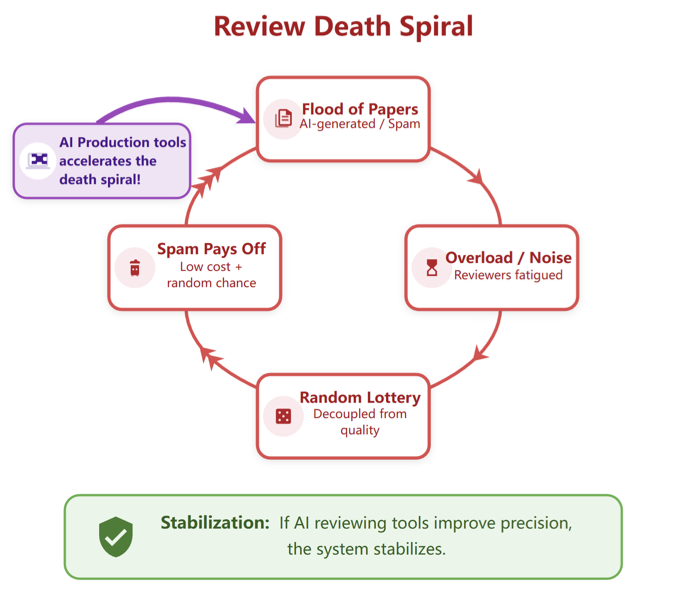
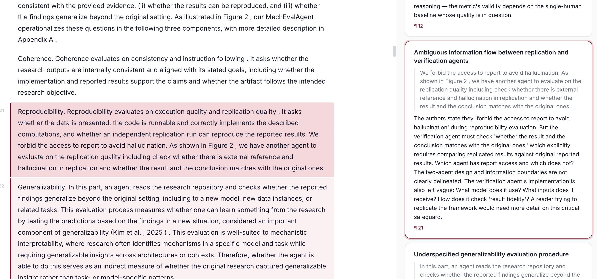

# AI-assisted Reviewing is Necessary and Should be Open

Academic peer review is at an inflection point. AI tools are transforming the production process, and [our scientific community need to shift focus towards selection and evaluation](https://cichicago.substack.com/p/the-mirage-of-autonomous-ai-scientists). I believe that the right response is not to resist AI in review, but to embrace it deliberately and openly.

In this post, I lay out why AI-assisted reviewing is necessary, why it should be open, and what we are doing about it with [OpenAIReview](https://openaireview.github.io).

## AI-assisted reviewing is necessary

The peer review process is not sustainable. [Bergstrom and Gross](https://arxiv.org/abs/2507.10734) described a positive feedback cycle: when submissions overwhelm the reviewer pool, review accuracy degrades. Lower accuracy makes acceptance more random, which improves the odds for weak papers. This incentivizes even more submissions, pushing the system further toward collapse. We refer to this phenomenon as the **review death spiral** (kudos to Jon Kleinberg for this name).

We recently extended this work to incorporate the impact of AI. As shown above, AI production tools speed up the spiral by making it cheaper to submit. The collapse is not gradual: once costs fall below a critical threshold, the system jumps suddenly to a state where nearly all authors submit regardless of quality. 

The only intervention that can stabilize or recover the system is improving **review precision**: the ability to discriminate high-quality from low-quality papers. Human reviewer precision degrades under load, and the reviewer pool cannot scale fast enough to keep pace. AI-assisted reviewing is necessary precisely because it is the only scalable path to the precision improvements needed to counteract AI production tools.

## AI-assisted reviewing should be open

My next proposition is that AI-assisted reviewing should be open for the following reasons.

**Openness enables equity.** Closed, proprietary review tools are accessible only to researchers at well-resourced institutions. Open tools give researchers at under-resourced institutions and in underrepresented communities the same access to high-quality feedback. 

**Openness enables customization.** Different fields have different norms, different methodological standards, and different definitions of what makes a paper strong. An open system lets the community adapt reviewing tools to their specific needs, rather than accepting a one-size-fits-all product. Researchers can inspect the prompts, audit the outputs, and modify the behavior.

**Openness enables repeated feedback.** An expensive closed tool cannot provide frequent feedback, but iterative feedback is how papers actually improve. An open tool can be used throughout the writing process, by authors themselves, by advisors, by collaborators, at any stage.

**Openness enables continual improvement.** A closed tool improves only when its developers choose to update it. An open tool improves whenever anyone in the community identifies a problem, proposes a better prompt, or contributes a new evaluation. The tool gets better faster, and the community builds shared ownership over a resource they all depend on.

**Openness keeps the stakes honest.** Last but not least, AI-assisted reviewing will shape what gets published and what does not. That is too consequential to leave to closed, proprietary systems with no public accountability. The scientific community should be able to see, question, and improve the tools that influence its own knowledge production.

We are releasing [OpenAIReview](https://openaireview.github.io) for this purpose. If you would like to customize this package, a lot of key information is in [prompts.py](https://github.com/ChicagoHAI/OpenAIReview/blob/main/src/reviewer/prompts.py). We will also explore whether it is possible to achieve similar quality with just a claude skill for users that already have claude code. Any feedback is welcome!

## Two types of reviewing

It is useful to distinguish between two different goals that reviewing serves.

**Reviewing for quality** is the feedback that authors seek to improve the quality of their papers as much as possible. It asks: how can this paper be stronger? What is unclear? What experiments are missing? What related work should be cited? This is formative feedback aimed at improving the work. The author decides what to do with it. 

This is what [Refine](https://www.refine.ink/) does and is the inspiration of OpenAIReview. This type of reviewing benefits most from being open and accessible. Authors know their own work best, and they are in the best position to judge whether feedback is useful. An open tool that provides this kind of feedback early and often can raise the quality of submissions across the board.

**Reviewing for gatekeeping** is the review that determines whether a paper is accepted or rejected. Gatekeeping is by nature subjective: no paper is without limitations, and pointing them out alone does not justify rejection. It would not have been ideal if we only accept the most robust but boring results (see [here](https://jessicahullman.substack.com/p/living-the-metascience-dream-or-nightmare) for more discussion from Jessica Hullman). The most profound ideas are the ones that change how people think, and their impact may not be immediately obvious from the experiments in the paper. This is what [Stanford Agentic Reviewer](https://paperreview.ai/) does, and I would recommend caution.

Current review processes often confound these two goals, and thorough review of every detail is impossible given the time constraints human reviewers face. AI-generated reviews can surface issues and inform editors and area chairs, but the final acceptance decision requires weighing factors that resist automation. This is the part of AI-assisted reviewing that will change quickly, and where the most care is needed. We are cautious about fully automating gatekeeping decisions, and believe human oversight is essential.

## Performance Comparison with Refine

[Refine](https://www.refine.ink/) is the key inspiration for this work. So we did a comparison with Refine while developing our first version of reviews. To benchmark, we used four papers from Refine's examples, each with comments from Refine identifying specific errors — 52 Refine comments total across genetics, information theory, economics, and neuroscience. Since this dataset is very small, it is best that you directly look at the examples on these pages.

For readers who are interested in numerical comparisons, our primary metric is LLM-judge recall and position recall: a judge model determines whether a predicted comment and a Refine comment refer to the same issue, within a location window.

We tested three approaches, all using Claude Opus 4.5:

- **Zero-shot**: the full paper in a single prompt. Cheapest, but misses almost everything (0% LLM recall).
- **Local**: splits the paper into paragraphs, filters candidates, then deep-checks each with local context. Reaches 15% LLM recall at ~$0.91/paper.
- **Progressive**: processes the paper sequentially while maintaining a running summary of definitions, equations, and key claims. After a post-hoc consolidation step, it reaches **25% LLM recall** (44% pre-consolidation) at ~$4/paper, with 83% location coverage.

| Method | Comments | LLM Recall | Location Recall | Cost/paper |
|---|---|---|---|---|
| Zero-shot | 23 | 0% | 23.1% | ~$0.3 |
| Local | 211 | 15.4% | 50.0% | ~$1 |
| Progressive | 68 | 25.0% | 69.2% | ~$4 |
| Progressive (Full) | 247 | 44.2% | 86.5% | ~$4 |

The key finding is that maintaining a running summary dramatically improves recall: the model can catch inconsistencies that span many pages, rather than treating each section in isolation. With the progressive approach, we can generate many more comments than Refine (68 vs. 52 or 247 vs. 52 if one prefers the full version) with strong recall — 87% location recall means the model finds something at nearly every location Refine flagged. The remaining gap between location recall and LLM recall reflects cases where the model looks in the right place but identifies a different issue. 

In short, you can now get a high-quality review for the price of a coffee or less.

## Our next steps

**Evaluation.** A significant problem in this space is that we do not have good evaluation for AI-generated reviews. How do we know whether a review is helpful? This is hard to measure and existing human reviews are by no means the groundtruth. That is also part of why we start from reviewing for quality: the authors themselves can decide whether the feedback is useful. Building good evaluation for review quality is a priority. We welcome ideas and will start to work on this.

**Execution-grounded reviewing.** Current AI review tools read papers as text. But many claims in papers can be verified directly: code can be executed, statistical results can be checked, figures can be validated against reported numbers. Execution-grounded reviewing shifts the process from trusting author claims to verifying them. This is something AI can do that human reviewers typically cannot, and it is a meaningful expansion of what review can catch. We have done some early work in the context of mechanistic interpretability, and will work on this integration.

**Exploring ways to make it helpful for gatekeeping-style reviewing.** We are interested in how AI-assisted reviewing can be useful for editors, area chairs, and peer reviewers in the acceptance process, while being careful about the risks. If you are a conference organizer, journal editor, or book editor, we would love to chat with you to see if this tool can be helpful for you.

**Improving usability.** We are also interested in making this available as an online tool, so that it is accessible without any setup. Making the workflow smooth enough that researchers actually use it throughout the writing process, not just as a one-time check, is a goal we are actively working toward. Please drop a note if you would like to help test the tools. If you are interested in using this tool but cannot for any reason, you can fill out this form and we will try our best to accommodate in the meantime.

Let us build the future of AI-assisted reviewing together!
